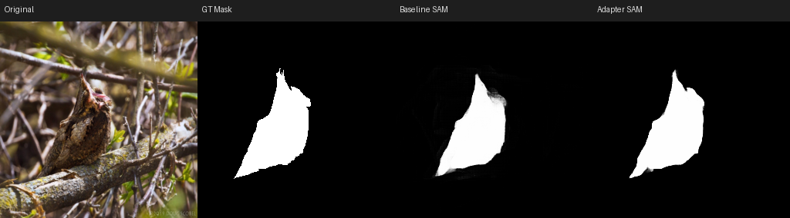
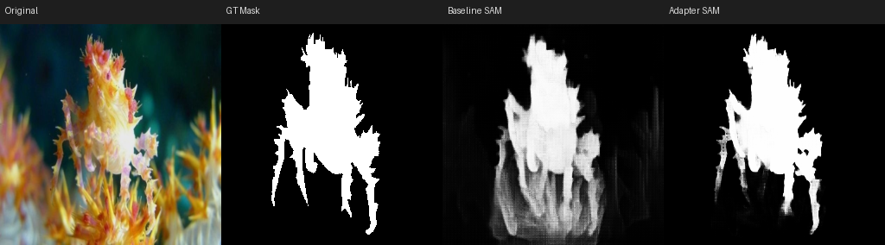
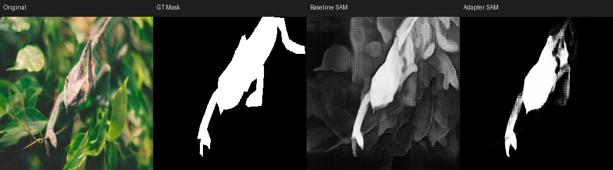
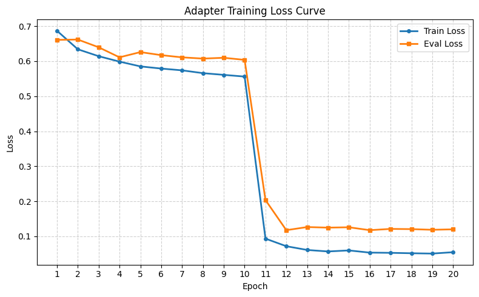

# SAM-Adapter for Camouflaged Object Detection





Fine-tuning [Segment Anything Model (SAM)](https://segment-anything.com/) with lightweight **bottleneck adapters** for **Camouflaged Object Detection** on the COD10K dataset. By injecting small adapter modules into SAM's ViT-B image encoder, we achieve competitive segmentation performance while training only **~1.2% of total parameters**.

---

## Quick Start

```bash
# Install dependencies
pip install -r requirements.txt

# Train (default: all 12 ViT blocks, bottleneck=64, zero-init)
python train.py

# Train with custom config
python train.py --bottleneck 128 --topk 6

# Evaluate on test set
python eval.py --checkpoint outputs/best_adapter_all_bn64.pth --model-type adapter

# Evaluate with visual output
python eval.py --checkpoint outputs/best_adapter_all_bn64.pth --model-type adapter --save-visuals
```

---

## Table of Contents

- [Quick Start](#quick-start)
- [My Contributions](#my-contributions)
- [Method](#method)
- [Project Structure](#project-structure)
- [Dataset](#dataset)
- [Training](#training)
- [Evaluation](#evaluation)
- [Results](#results)
- [References](#references)

---

## My Contributions

This is a group project for CS 566 (Deep Learning). My responsibilities include:

- **Adapter Module** — Designed and implemented the bottleneck adapter architecture with zero-initialization strategy, ensuring the model starts from SAM's original behavior and gradually learns task-specific features
- **Training Pipeline** — Built the end-to-end training loop with mixed-precision training (`torch.amp`), cosine annealing LR scheduler, and a combined BCE + Dice loss for handling class imbalance in camouflaged scenes
- **Evaluation Framework** — Implemented a comprehensive evaluation suite with standard COD metrics: S-measure (S<sub>α</sub>), weighted F-measure (F<sub>β</sub><sup>ω</sup>), E-measure, MAE, and multiple thresholding strategies (adaptive, mean, max)
- **Ablation Study** — Conducted experiments comparing full-block vs. top-k adapter injection to analyze the trade-off between parameter efficiency and segmentation quality

---

## Method

### Adapter Architecture

We insert lightweight **bottleneck adapters** after each Transformer block in SAM's ViT-B image encoder. Each adapter is a residual module:

```
             +---------------------------------------------+
Input x ---> | Linear(dim -> 64) -> GELU -> Linear(64 -> dim) | ---> x + adapter(x)
             +---------------------------------------------+
```

**Key design decisions:**

| Decision | Choice | Rationale |
|---|---|---|
| Insertion point | After each ViT block (post-block) | Captures high-level features without modifying attention |
| Bottleneck dim | 64 | Balance between capacity and parameter count |
| Initialization | Zero-init on up-projection | Adapter output starts at zero, model initially behaves as vanilla SAM |
| Trainable scope | Adapter params only | All original SAM weights are frozen |

### Top-k Block Selection

Instead of adapting all 12 ViT-B blocks, we support injecting adapters into only the **last k blocks**. This allows exploring the trade-off between the number of trainable parameters and performance.

### Other Approach: LoRA

A teammate implemented [LoRA (Low-Rank Adaptation)](https://arxiv.org/abs/2106.09685) as an alternative PEFT strategy, injecting low-rank matrices into the attention QKV layers for comparison.

---

## Project Structure

```
.
├── train.py                  # Training pipeline (mixed-precision, cosine LR)
├── eval.py                   # Evaluation with full COD metrics
├── loss_curve.ipynb          # Loss curve visualization
├── scripts/
│   ├── config.py             # Paths, hyperparameters, defaults
│   ├── dataset.py            # COD10KDataset (PyTorch Dataset)
│   ├── adapter.py            # Adapter module & SAM-Adapter builder
│   ├── model_lora.py         # LoRA injection utilities
│   └── utils.py              # Seed, bbox, jitter utilities
├── dataset/
│   ├── train/                # Training split (Image/ + GT_Object/)
│   ├── eval/                 # Validation split
│   └── test/                 # Test split
├── checkpoints/
│   └── sam_vit_b_01ec64.pth  # SAM ViT-B pretrained weights
├── Docs/                     # Course reports
└── README.md
```

---

## Dataset

We use the [**COD10K-v3**](https://github.com/DengPingFan/SINet-V2) dataset. Each split contains paired RGB images and binary ground-truth masks:

```
dataset/{train,eval,test}/
├── Image/          # RGB images (.jpg)
└── GT_Object/      # Binary masks (.png)
```

**Preprocessing:**
- Images and masks are resized to **256 x 256**
- Bounding-box prompts are automatically derived from ground-truth masks
- Training applies **bbox jitter (+/-10%)** for augmentation

### Pretrained Weights

Download the SAM ViT-B checkpoint (~375 MB):

```bash
wget https://dl.fbaipublicfiles.com/segment_anything/sam_vit_b_01ec64.pth -P checkpoints/
```

---

## Training

```bash
# Default: all blocks, bottleneck=64, zero-init
python train.py

# Custom adapter config
python train.py --bottleneck 128 --topk 6

# Disable zero-initialization
python train.py --no-zero-init
```

### CLI Arguments

| Argument | Default | Description |
|---|---|---|
| `--bottleneck` | 64 | Adapter bottleneck dimension |
| `--topk` | None (all) | Number of last ViT blocks to inject adapters into |
| `--zero-init` / `--no-zero-init` | True | Zero-initialize adapter up-projection |

### Configuration

Other training hyperparameters are defined in [`scripts/config.py`](scripts/config.py):

| Parameter | Value |
|---|---|
| Optimizer | AdamW |
| Learning rate | 1e-4 |
| Scheduler | CosineAnnealingLR (eta_min = 1e-6) |
| Epochs | 20 |
| Batch size | 256 |
| Loss function | BCEWithLogitsLoss + Dice Loss |
| Mixed precision | Enabled (CUDA) |

### Outputs

Training produces the following artifacts in `outputs/`:

- `best_adapter_{tag}_bn{bottleneck}.pth` — Best checkpoint (by eval loss)
- `loss_curves/loss_history_{tag}.csv` — Per-epoch metrics (loss, LR, time, memory)
- `loss_curves/loss_curve_{tag}.png` — Loss curve plot

---

## Evaluation

```bash
python eval.py \
    --checkpoint outputs/best_adapter_all_bn64.pth \
    --model-type adapter \
    --bottleneck 64
```

### Metrics

We evaluate with the standard camouflaged object detection metrics:

| Metric | Symbol | Description |
|---|---|---|
| Structure Measure | Sa | Structural similarity between prediction and GT |
| Weighted F-measure | Fbw | Distance-weighted precision-recall |
| MAE | M | Mean absolute error (lower is better) |
| E-measure | Ead / Emn / Emx | Enhanced alignment (adaptive / mean / max threshold) |
| F-measure | Fad / Fmn / Fmx | F-score at adaptive / mean / max threshold |

---

## Results

| Model | S<sub>α</sub> ↑ | F<sub>β</sub><sup>ω</sup> ↑ | MAE ↓ | E<sub>max</sub> ↑ | F<sub>max</sub> ↑ | Trainable Params |
|---|---|---|---|---|---|---|
| SAM ViT-B (frozen) | 0.585 | 0.353 | 0.108 | 0.535 | 0.423 | 0 |
| + Adapter (all 12 blocks) | 0.957 | 0.437 | 0.012 | 0.990 | 0.456 | ~1.2M |
| + Adapter (top-k=6) | 0.883 | 0.372 | 0.055 | 0.984 | 0.405 | ~0.6M |
| + LoRA (blocks 10-11) | 0.839 | 0.767 | 0.032 | 0.607 | 0.334 | ~49K |



---

## References

- Kirillov, A., et al. "Segment Anything." *ICCV 2023*. [[paper]](https://arxiv.org/abs/2304.02643)
- Chen, T., et al. "SAM-Adapter: Adapting Segment Anything in Underperformed Scenes." *ICCV Workshop 2023*. [[paper]](https://arxiv.org/abs/2304.09148)
- Fan, D.-P., et al. "Concealed Object Detection." *TPAMI 2022*. [[paper]](https://arxiv.org/abs/2102.10274) [[dataset]](https://github.com/DengPingFan/SINet-V2)
- Hu, E. J., et al. "LoRA: Low-Rank Adaptation of Large Language Models." *ICLR 2022*. [[paper]](https://arxiv.org/abs/2106.09685)
